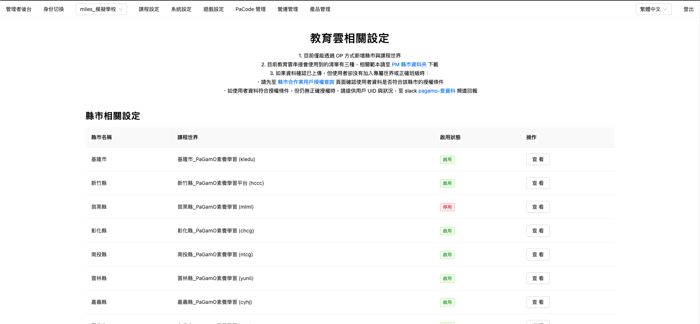

# 管理後台-澔學相關設定頁面

本篇涵蓋開發機制說明，內容較多且複雜，如你是運營可直接查看 xxx\_page，可快速的從縣市服務的角度來完成相關設定


本頁面的 UI 與微互動，前端製作時可直接參考[教育雲相關設定後台](https://www.pagamo.org/admin/city_gov_case)


<figure><figcaption></figcaption></figure>

## 相關開發檔案

1. 澔學管理後台設計稿：[Figma](https://www.figma.com/design/LuYxbf6GCfzL3Xp9syFSuD/%E7%AE%A1%E7%90%86%E5%BE%8C%E5%8F%B0%2F%E6%BE%94%E5%AD%B8%E7%9B%B8%E9%97%9C%E8%A8%AD%E5%AE%9Av1.0.0?node-id=4801-51753\&t=yxfdh8UqzVuEzu1F-0)


1) 每頁 Figma 中的編號，可直接對應到 gitbook 的列點說明
2) 編號有紅底的代表跟既有教育雲有所不同


## a. 列表頁面

{% embed url="https://www.figma.com/design/LuYxbf6GCfzL3Xp9syFSuD/%E7%AE%A1%E7%90%86%E5%BE%8C%E5%8F%B0%2F%E6%BE%94%E5%AD%B8%E7%9B%B8%E9%97%9C%E8%A8%AD%E5%AE%9Av1.0.0?node-id=4801-56239&t=yxfdh8UqzVuEzu1F-0" %}

### **a1. 頁面位置**

1. 管理者後台＞營運管理＞縣市合作案 > 澔學相關設定
2. 縣市合作案中已有一個教育雲相關設定，澔學相關設定放在教育雲下方

### **a2. 頁面標題與描述**

1. PM資料夾與縣市合作案用戶授權查詢，分別置入連結
2. PM資料夾：
   1. 會連結到 PM 雲端的範例清單目錄
   2. Link：[https://boniotw-my.sharepoint.com/personal/bonio\_share\_bonio\_com\_tw/\_layouts/15/onedrive.aspx?isAscending=false\&id=%2Fpersonal%2Fbonio%5Fshare%5Fbonio%5Fcom%5Ftw%2FDocuments%2FPaGamO%2FPM%20Team%2F01%5FPaGamO%E7%94%A2%E5%93%81%E7%9F%A5%E8%AD%98%2F11%5F%E7%B8%A3%E5%B8%82%E6%94%BF%E5%BA%9C%E5%90%88%E4%BD%9C%E6%A1%88%E7%9B%B8%E9%97%9C%2F%E7%B8%A3%E5%B8%82%E5%90%88%E4%BD%9C%E6%A1%88%2F%E6%95%99%E8%82%B2%E9%9B%B2%E4%B8%B2%E6%8E%A5%E7%B8%A3%E5%B8%82%E7%AF%84%E4%BE%8B%E6%B8%85%E5%96%AE%2F%E6%BE%94%E5%AD%B8%E6%8E%88%E6%AC%8A%E6%B8%85%E5%96%AE%E7%AF%84%E4%BE%8B\&sortField=LinkFilename\&view=0](https://boniotw-my.sharepoint.com/personal/bonio_share_bonio_com_tw/_layouts/15/onedrive.aspx?isAscending=false\&id=%2Fpersonal%2Fbonio%5Fshare%5Fbonio%5Fcom%5Ftw%2FDocuments%2FPaGamO%2FPM%20Team%2F01%5FPaGamO%E7%94%A2%E5%93%81%E7%9F%A5%E8%AD%98%2F11%5F%E7%B8%A3%E5%B8%82%E6%94%BF%E5%BA%9C%E5%90%88%E4%BD%9C%E6%A1%88%E7%9B%B8%E9%97%9C%2F%E7%B8%A3%E5%B8%82%E5%90%88%E4%BD%9C%E6%A1%88%2F%E6%95%99%E8%82%B2%E9%9B%B2%E4%B8%B2%E6%8E%A5%E7%B8%A3%E5%B8%82%E7%AF%84%E4%BE%8B%E6%B8%85%E5%96%AE%2F%E6%BE%94%E5%AD%B8%E6%8E%88%E6%AC%8A%E6%B8%85%E5%96%AE%E7%AF%84%E4%BE%8B\&sortField=LinkFilename\&view=0)
3. 縣市合作案用戶授權查詢：
   1. 連結至後台查詢頁面：[https://www.pagamo.org/admin/city\_gov\_case\_debuggers](https://www.pagamo.org/admin/city_gov_case_debuggers)
4. pagamo-查資料連結：[https://bonio.slack.com/archives/C02VAQCSD7E](https://bonio.slack.com/archives/C02VAQCSD7E)

### **a3. 列表**

1. 此清單資料直接由後端回傳，使用者無法新增或刪除
2. 列表預設排序：縣市名稱
   1. 請依照下列順序排序：新北市、花蓮縣
3. 縣市名稱欄位：
   1. &#x20;會分別對應至「學校代碼表」前兩碼
   2. 縣市名稱在此列表中不能重複（一個縣市只能有一個設定 ）
4. 課程世界欄位：
   1. 在此列表中不能重複
   2. 一個課程世界只能對應一個縣市&#x20;
   3. 顯示課程世界中文名稱+課程代碼：{課程中文名稱}({課程代碼})
5. 啟用狀態欄位：
   1. 顯示啟用狀態，有兩種狀態： 啟用（綠色） 停用（紅色）

Q：為什麼列表沒有「新增」縣市的功能？

因為台灣只有 20 多個縣市，開放後台新增或編輯縣市名稱跟課程代碼等，反而要考量更多的錯誤情境，不如在每次確認合作後，都透過嚴謹的 OP 方式新增並限制不可編輯，新增方式可參考：

1. 教育雲新增苗栗票：[https://redmine.bonio.com.tw/issues/38482](https://redmine.bonio.com.tw/issues/38482)&#x20;
2. 澔學：與教育雲做法相同

開新增 OP 票時要確認好的資料：

1. 縣市名稱：苗栗縣（舉例）
2. 課程代碼：可到[後台](https://www.pagamo.org/admin/courses)查詢，設定後不可再變更
3. 合約到期日：設定完仍可修改，使用者每次登入都會依據此欄位更新 GC 到期日
4. 啟用狀態：停用（<mark style="color:red;">請都先設停用，上線後再開啟</mark>）

## b.  列表-查看

{% embed url="https://www.figma.com/design/LuYxbf6GCfzL3Xp9syFSuD/%E7%AE%A1%E7%90%86%E5%BE%8C%E5%8F%B0%2F%E6%BE%94%E5%AD%B8%E7%9B%B8%E9%97%9C%E8%A8%AD%E5%AE%9Av1.0.0?node-id=4845-4188&t=6uugcLgHm8DCCxYX-0" %}

### b1. 查看縣市設定

1. 使用者在查看階段均無法編輯

### b2. 啟用狀態

1. 單純開關

### b3. 合約到期日

1. tooltip 內容為：屬於此年級的學生才會滿足加入世界的條件
2. 合約到期日：完整顯示年月日時分秒

合約到期日顯示到年月日時分秒的原因？

過去會單獨設定年月日，舉例：2024/03/01。實際在此案例中，使用上很容易困惑是 2024/03/01 00:00 or 2024/03/01 23:59，所以才調整成完整顯示

### b4. 特殊職稱：&#x20;

1. tooltip 內容為：如不具備特殊職稱的老師想成為校內所有學生班級的管理者，請將該老師資料填入「校管帳號清單」
2. 顯示使用者輸入的關鍵字，如有多個就往下全部列出
3. 空值：直接空白（與帳號管理介面一致）

### b5. 全年級教材授權

1. tooltip:設定不同年級學生可獲得的授權教材內容
2. 點擊查看會跳出新的彈窗，設計請參考 [#id-5.-quan-nian-ji-jiao-cai-shou-quan](guan-li-hou-tai-hao-xue-xiang-guan-she-ding-ye-mian.md#id-5.-quan-nian-ji-jiao-cai-shou-quan "mention")

### b6. 特殊學校/班級授權/校管帳號清單

1. 特殊學校 tooltip: 設定不同年級學生可獲得的授權教材內容
2. 班級授權 tooltip: 檔案請以「學校」為單位，上傳前請壓縮成 zip 檔案
3. 校管帳號 tooltip：如不具備特殊職稱的老師想成為校內所有學生班級的管理者，請將該老師資料填入「校管帳號清單」
4. 沒有檔案時顯示：無上傳檔案
5. 有上傳檔案時：完整顯示檔名，使用者也可點擊下載檔案

### b7. 開放私校加入

1. tooltip：系統是根據學校代碼判斷學校是否為私校
2. 單純開關
3. 預設為關閉

### b8. 可進入此世界的學生年級

1. tooltip： 屬於此年級的學生才會滿足加入世界的條件
2. 顯示已選擇的年級數字&#x20;
3. 空值：直接空白（與帳號管理介面一致）&#x20;

## c. 列表-查看-編輯

{% embed url="https://www.figma.com/design/LuYxbf6GCfzL3Xp9syFSuD/%E7%AE%A1%E7%90%86%E5%BE%8C%E5%8F%B0%2F%E6%BE%94%E5%AD%B8%E7%9B%B8%E9%97%9C%E8%A8%AD%E5%AE%9Av1.0.0?node-id=4845-4189&t=DcGyExaaC9WkPEnP-0" %}


Tooltips 的內文統一寫在新增 [#b.-lie-biao-cha-kan](guan-li-hou-tai-hao-xue-xiang-guan-she-ding-ye-mian.md#b.-lie-biao-cha-kan "mention")


### c1. 編輯縣市設定

1. 使用者可編輯有開放編輯的資料

### c2. 縣市名稱

不開放使用者在後台編輯，原因參考： [#q-wei-shen-me-lie-biao-mei-you-xin-zeng-xian-shi-de-gong-neng](guan-li-hou-tai-hao-xue-xiang-guan-she-ding-ye-mian.md#q-wei-shen-me-lie-biao-mei-you-xin-zeng-xian-shi-de-gong-neng "mention")

### c3. 課程世界

不開放使用者在後台編輯，原因參考： [#q-wei-shen-me-lie-biao-mei-you-xin-zeng-xian-shi-de-gong-neng](guan-li-hou-tai-hao-xue-xiang-guan-she-ding-ye-mian.md#q-wei-shen-me-lie-biao-mei-you-xin-zeng-xian-shi-de-gong-neng "mention")

### c4. 啟用狀態

1. 啟用：澔學使用者每次登入時，會進入專屬世界流程
2. 停用：澔學使用者每次登入時，不會進入專屬世界流程

### c5. 合約到期日

1. tooltip 內容參考 b3
2. 澔學使用者每次登入時，會依據合約到期日，來設定專屬世界的 GC 到期日。
3. 合約到期日的設定要有年月日時分秒。 [#he-yao-dao-qi-ri-xian-shi-dao-nian-yue-ri-shi-fen-miao-de-yuan-yin](guan-li-hou-tai-hao-xue-xiang-guan-she-ding-ye-mian.md#he-yao-dao-qi-ri-xian-shi-dao-nian-yue-ri-shi-fen-miao-de-yuan-yin "mention")

<figure><figcaption></figcaption></figure>

### c6. 特殊職稱

1. tooltip 內容參考 b4
2. 特殊職稱由使用者自行輸入建立，目前沒有數量上限
3. 使用者要可以持續輸入建立多筆，並使用者可以移除輸入的內容

&#x20;

1. 寫「資訊組長」時，只要有比對到此關鍵字，就會授權，如：資訊組長、資深資訊組長、資訊組長暨XXXX等都會授權&#x20;
2. 新北目前已有使用的職稱都請直接匯入，花蓮如有也請協助匯入
3. 特殊職稱的驗證：&#x20;
   1. 只能 4 字元（兩個中文字）以上，30字元（十五個中文字）以下
   2. 不能有特殊符號（後端查詢現有現況職稱確認）&#x20;

### c7. 全年級教材授權

1. tooltip 內容參考 b5
2. 點擊查看會跳出新的彈窗，設計請參考 [#id-5.-quan-nian-ji-jiao-cai-shou-quan](guan-li-hou-tai-hao-xue-xiang-guan-she-ding-ye-mian.md#id-5.-quan-nian-ji-jiao-cai-shou-quan "mention")

### c8. 特殊學校/班級授權/校管帳號清單

1. 三個tooltip：參考b6
2. 新增後，儲存就取代舊檔案
3. 只能上傳一筆(file)，使用者上傳新的後，直接取代舊的檔案
4. 檔案大小限制：均必須小於 5mb
5. 檔案格式限制：&#x20;
   1. 特殊學校清單、校管帳號清單：xlsx&#x20;
   2. 班級授權清單：zip tooltip:&#x20;
6. 錯誤提示（前端處理）： 格式錯誤：`上傳格式須是 ${FILE_TYPE}` 檔案過大：`上傳檔案大小須小於 ${MAX_FILE_SIZE_MB} MB`&#x20;
7. 使用者設定的縣市名稱、課程世界與清單內容會應用到澔學使用者加入專屬世界與相關授權上（ [.](./ "mention"))
8. 清單上傳需要檢核，錯誤的內容顯示方式： [#e.-lie-biao-cha-kan-bian-ji-cuo-wu-ti-shi](guan-li-hou-tai-hao-xue-xiang-guan-she-ding-ye-mian.md#e.-lie-biao-cha-kan-bian-ji-cuo-wu-ti-shi "mention")

### c9. 開放私校加入

1. tooltip參考b7
2. 啟用：澔學私校使用者每次登入時，會進入專屬世界流程
3. 停用：澔學私校使用者每次登入時，不會進入專屬世界流程
4. 預設為關閉
5. 私校定義：學校代碼中的設立別屬於「1」(私立)

學校代碼表分為所在地、設立別、類別與流水號，完整可參考下圖：

.png>)

### c10. 可進入此世界的學生年級

1. tooltip參考b8
2. 選項可複選，選項數字依序為： 1- 12&#x20;
3. 使用者可以移除已有的選項&#x20;
4. 學生在澔學的年級資訊，必須符合這邊的年級設定，才可進入世界，並觸發後續流程

## d. .列表-查看-全年級教材授權

{% embed url="https://www.figma.com/design/LuYxbf6GCfzL3Xp9syFSuD/%E7%AE%A1%E7%90%86%E5%BE%8C%E5%8F%B0%2F%E6%BE%94%E5%AD%B8%E7%9B%B8%E9%97%9C%E8%A8%AD%E5%AE%9Av1.0.0?node-id=4845-4224&t=jFHnw4KzhCpwWcmO-0" %}

### **d1. 全年級教材授權-學期欄**

1. 選單內容來自「台灣學年學期設定」&#x20;
2. 選單順序：越新學年學期在越前面， 112-2 > 112-1 > 111-2&#x20;
3. 沒有「台灣學年學期」的狀態
   1. 會有沒有學年學期的狀態，沒有時顯示：您尚未設定學年學期 請先至「台灣學年學期設定」頁面設定。 點擊「前往台灣學年學期設定」，另開新分頁

### **d2. 全年級教材授權-商品名稱欄位**

1. 滑動時，表格固定住第一欄(欄位名稱)跟第一與二列(商品名稱、公私校授權)
2. 同時顯示商品名稱跟代碼
3. 目前無指定排序規則（是根據資料庫自已決定拿比較快，就會依照這個順序回傳：[slack](https://bonio.slack.com/archives/C04QF8AATS8/p1722304915301649?thread_ts=1722220555.075109\&cid=C04QF8AATS8)）
4. 會有沒有商品的空狀況(尚未有授權商品)
5. 沒有「授權商品」的狀態：提示「尚未有授權商品」

### **d3. 全年級教材授權-年級欄位**

1. 年級直接固定顯示 1-12 年級&#x20;

### d4. 說明文字

1. 顯示兩行文字：
   1. 使用者重新登入後，系統會先檢查商品代碼是否具備「數位學習精進案自動授權」受眾標籤，有才會再執行移除教材流程
   2. 如開放私校進入世界，但私校不屬於全年段授權，又想授權教材時，就需要透過班級授權清單指定私校班級授權

### d5. **全年級教材授權-**&#x516C;私校授權欄位

1. 滑動時，表格固定住第一欄(欄位名稱)跟第一與二列(商品名稱、公私校授權)
2. 完整顯示使用者選擇的內容，文字最長為「公私校都有」

## e. 列表-查看-編輯-全年級教材授權

{% embed url="https://www.figma.com/design/LuYxbf6GCfzL3Xp9syFSuD/%E7%AE%A1%E7%90%86%E5%BE%8C%E5%8F%B0%2F%E6%BE%94%E5%AD%B8%E7%9B%B8%E9%97%9C%E8%A8%AD%E5%AE%9Av1.0.0?node-id=5329-3211&t=9JniGa8VWlXRoHd0-0" %}

### **e1. 全年級教材授權-學年學期**

1. 選單內容來自「台灣學年學期設定」&#x20;
2. 選單順序：越新學年學期在越前面， 112-2 > 112-1 > 111-2&#x20;
3. 會有沒有學年學期的狀態：&#x20;
   1. 沒有時顯示：您尚未設定學年學期 請先至「台灣學年學期設定」頁面設定。點擊「前往台灣學年學期設定」，另開新分頁
4. &#x20;如果使用者「有異動授權」時，又切換學年學期時，彈窗提示：
   1. 標題：您確定要切換學年學期嗎？&#x20;
   2. 內文：您的更動尚未被儲存。若離開此頁，系統不會儲存你所做的變更。&#x20;
   3. 按鈕：切換|返回

### **e2. 全年級教材授權-新增商品**

1. 點擊新增商品後，會再開啟「新增 To G 商品」頁面
   1. 商品這邊只顯示有 「數位學習精進案自動授權」的受眾標籤的商品
   2. 使用者在「新增商品」勾選商品後且按下「新增」後，會再將勾選的商品插入到「全年級教材授權」列表的最上方，以方便使用者設定授權。
      1. 新增商品後預設年級教材授權是「全不勾選」

Q：一個商品教材，可以新增兩次，在全年級教材授權做兩次設定嗎？(<a href="https://bonio.slack.com/archives/C04QF8AATS8/p1723431451670119?thread_ts=1723431051.319199&#x26;cid=C04QF8AATS8">slack</a>)

不行，後台設計是相同教材無法重複設定兩次，後端也會限制同一個教材不能有多個公私校授權條件。

Q：如果教材 A 在 1-3 年級是開放公校，但在 4-6 年級是開放公私校時，該如何設定？

如果教材 A 在 1-3 年級是開放公校，教材 A 在 4-6 年級是開放公私校，請直接拆分兩個教材來管理誕但派發任務來管理。舉例：

1. 既有 A 在 1-3 年級是開放公校
2. 新增 B 在 4-6 年級是開放公私校

### **e3. 全年級教材授權-商品名稱欄位**

1. 滑動時，表格固定住第一欄(欄位名稱)跟第一與二列(商品名稱、公私校授權)
2. 同時顯示商品名稱跟代碼
3. 目前無指定排序規則（是根據資料庫自已決定拿比較快，就會依照這個順序回傳：[slack](https://bonio.slack.com/archives/C04QF8AATS8/p1722304915301649?thread_ts=1722220555.075109\&cid=C04QF8AATS8)）
4. 會有沒有商品的空狀況(尚未有授權商品)

### **e4. 全年級教材授權-年級欄位**

1. 年級直接固定顯示 1-12 年級
2. 滑動時，表格固定住第一欄(欄位名稱)跟第一列(商品名稱)

### **e5. 全年級教材授權-使用者異動內容**

1. 使用者變更商品或授權年級後，在下方按鈕位置左側會出現提示文字：&#x20;
   1. 商品授權有更動，請先儲存後再查看其他學期

### **e6. 全年級教材授權-儲存**

1. 點擊儲存後，會跳出確認視窗：&#x20;
   1. 標題：確定要儲存更新後的授權內容嗎
   2. 內文：儲存後請再次檢查授權內容，再關閉授權視窗。&#x20;
   3. 按鈕：返回|確定
2. &#x20;「儲存」時檢查受眾標籤，如商品代碼的受眾標籤沒有「數位學習精進案自動授權」，在儲存時會出現「更新失敗」的錯誤視窗（後端檢查即可)

### **e7. 全年級教材授權-關閉**

1. 點擊關閉時，如授權教材有異動時，會跳出確認視窗：
2. 標題：確認要關閉教材授權嗎？
3. 內文：關閉後系統將不會儲存你所做的變更
4. 按鈕：關閉|返回

### **e8. 全年級教材授權-移除商品**

1. 使用者點擊「移除」商品後會跳出彈窗提示，使用者再次選擇「移除」後才移除商品
2. 實際移除教材要等使用者按下「儲存」後才會觸發

### **e9. 說明文字**

顯示兩行文字：

1. 使用者重新登入後，系統會先檢查商品代碼是否具備「數位學習精進案自動授權」受眾標籤，有才會再執行移除教材流程
2. 如開放私校進入世界，但私校不屬於全年段授權，又想授權教材時，就需要透過班級授權清單指定私校班級授權

### e10. 全年級教材授權-公私校授權欄位 

1. 此欄位為下拉選單，選項依序有「僅限公校、僅限私校、公私校都有」三個，預設值為「公私校都有」
2. 使用者必須在下拉選單中選擇其一，無法取消勾選
3. 滑動時，表格固定住第一欄(欄位名稱)跟第一與二列(商品名稱、公私校授權)
4. 完整顯示使用者選擇的內容，文字最長為「公私校都有」

## f. 列表-查看-編輯-錯誤提示

{% embed url="https://www.figma.com/design/LuYxbf6GCfzL3Xp9syFSuD/%E7%AE%A1%E7%90%86%E5%BE%8C%E5%8F%B0%2F%E6%BE%94%E5%AD%B8%E7%9B%B8%E9%97%9C%E8%A8%AD%E5%AE%9Av1.0.0?node-id=4845-4225&t=DcGyExaaC9WkPEnP-0" %}

### **f1. 錯誤顯示基本規則：**

1. &#x20;採用彈窗顯示： 特殊學校清單、班級授權清單、校管帳號清單、其他無法歸類之錯誤。
2. 錯誤訊息數量須設定上限，後端要避免全部傳給前端 一種類型的清單有錯誤時，即可回傳訊息給前端，不需要全部清單檢查完再回傳給前端
   1. \[給後端看]
這邊回傳的錯誤訊息，要用 Types::FieldErrorType
field name = argument name
方便前端判斷與顯示錯誤訊息

### **f2. 班級授權清單檢核內容：**

單純紀錄檢核內容，實際呈現方式參考點 1。

| 
<strong>錯誤情境</strong> 
 | 
<strong>錯誤訊息範例</strong> 
                                                                   |
| -------------------------------- | ---------------------------------------------------------------------------------------------------- |
| 
缺少必填欄位 
                | 
014767_invalid.xlsx - 英文教材班級申請表 - 找不到預期的 Header: ["學校代碼"] 
                                 |
| 
「學年度」為不正確的資料格式 
        | 
014767_invalid.xlsx - 中文教材班級申請表 - 第 1 筆資料的 「學年度」為不正確的資料格式: 110 
                            |
| 
「學期」為不正確的資料格式 
         | 
014767_invalid.xlsx - 中文教材班級申請表 - 第 2 筆資料的 「學期」為不正確的資料格式: 3 
                               |
| 
「學校代碼」為不正確的資料格式 
       | 
014767_invalid.xlsx - 中文教材班級申請表 - 第 4 筆資料的 「學校代碼」為不正確的資料格式: 151602 
                        |
| 
欄位為空值 
                 | 
014767_invalid.xlsx - 中文教材班級申請表 - 第 5 筆資料的 「school_year」不可為空 
                              |
| 
沒有商品代碼 
                | 
014767_invalid.xlsx - 中文教材班級申請表 - 第 6 筆資料的 「英文素養教材」或「中文素養教材」無法對應到商品代碼 
                     |
| 
不正確或不可使用的教材名稱 
         | 
014768_invalid.xlsx - 中文教材班級申請表 - 第 6 筆資料的 「英文素養教材」或「中文素養教材」包含不正確或不可使用的教材名稱: ["不存在的教材名稱"] 
 |
| 
學校代碼對應不到學校 
            | 
School code not found: ["014767", "014768"] 
                                               |

### f3. 「特殊學校清單檢核」內容

單純紀錄檢核內容，實際呈現方式參考點 1。

| 
<strong>錯誤情境</strong> 
 | 
<strong>錯誤訊息範例</strong> 
    |
| -------------------------------- | ------------------------------------- |
| 
Excel 檔案有多個工作表 
        | 
請確認 Excel 檔案中只有一個工作表 
       |
| 
缺少必填欄位 
                | 
請確認 Excel 檔案中有包含以下欄位: 學校代碼 
 |
| 
不屬於此縣市的學校代碼 
           | 
不屬於此縣市的學校代碼: 014326 
        |
| 
學校代碼對應不到學校 
            | 
無法找到學校代碼: 014326 
           |

### f4. 校管清單檢核內容

在校管清單中管理者帳號欄位，預期輸入的內容：

1. 新北輸入：[xxxx@ntpc.edu.tw](mailto:xxxx@ntpc.edu.tw)&#x20;
2. 花蓮：[xxxx@hlc.edu.tw](mailto:xxxx@hlc.edu.tw)

Ｑ： <strong>新北也有 xxx@apps.ntpc.edu.tw 但為什麼不行？</strong>

**跟澔學 line 群組確認的討論紀錄：**\
Q：澔學夥伴好，想請問新北親師生平台，我們資料收到的 email domain 是 @ntpc.edu.tw，但發現新北老師自己填寫 email 有些是 @apps.ntpc.edu.tw，這兩者之間是有什麼差異嗎？

舉例：huxinpei@ntpc.edu.tw/ huxinpei@apps.ntpc.edu.tw，會是同一位老師？

Ａ：是同一位老師沒錯。 帳號規格是 @ntpc.edu.tw ，新北發給學校老師的 email 則是 @apps.ntpc.edu.tw。

**最後結論：只認 @ntpc.edu.tw 作為管理者帳號**

1. 運營：[slack](https://bonio.slack.com/archives/C04BX54RS5D/p1722328831438149?thread_ts=1721719981.768069\&cid=C04BX54RS5D)
2. RD：[slack](https://bonio.slack.com/archives/C04QF8AATS8/p1722328640331359?thread_ts=1722222956.391589\&cid=C04QF8AATS8)

| 
<strong>錯誤情境</strong> 
 | 
<strong>錯誤訊息範例</strong> 
  |
| -------------------------------- | ----------------------------------- |
| 
Excel 檔案有多個工作表 
        | 
請確認 Excel 檔案中只有一個工作表 
     |
| 
缺少必填欄位 
                | 
請確認 Excel 檔案中有包含以下欄位: 學年 
 |
| 
不屬於此縣市的學校代碼 
           | 
不屬於此縣市的學校代碼: 014326 
      |
| 
學校代碼對應不到學校 
            | 
無法找到學校代碼: 014326 
         |
| 
欄位為空值 
                 | 
第 1 列的 學年 資料不可為空 
         |
| 
學校班級格式錯誤 
              | 
第 1 列的學校班級格式錯誤: 103a 
     |

