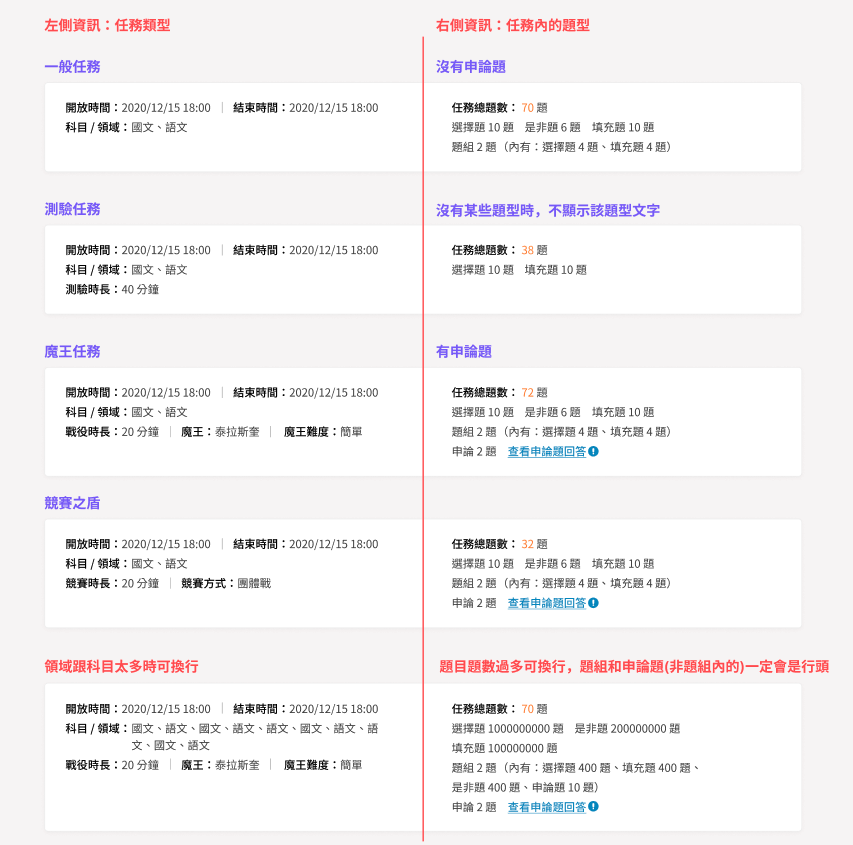

# C-單一任務數據

### 相關連結

1. Figma：[Link](https://www.figma.com/design/vLsXsmFOo0LiRKIwZMwD1L/%2339424-Part-I.%E6%95%99%E5%B8%AB%E7%AE%A1%E7%90%86%E5%BE%8C%E5%8F%B0%2F%E7%8F%AD%E7%B4%9A%E4%BB%BB%E5%8B%99%E6%95%B8%E6%93%9A?node-id=2993-64899\&t=oEVs7argTqlohV5I-4)
2. Redmine：[Link](https://redmine.bonio.com.tw/issues/40332)

### 單一任務數據

* 會顯示該班級學生在某任務的作答狀況
* 每種任務模式有各自顯示數據指標

此頁面分成下述幾個區塊

#### A-1 任務基本資訊區塊

* 麵包屑
* 任務名稱
* 班級名稱



一般模式（其他模式也都會有）的任務基本資訊，後面Tab只補充該模式新增的資訊，不重複描述與一般模式一樣的資訊

* 開放時間：年/月/日 時：分（24小時制）
* 結束時間：年/月/日 時：分（24小時制）
* 領域 / 科目：該任務題目所屬的科目，會完整的科目領域名稱
* 任務題數：
  * 該任務的總題數（題組會計算子題）
  * 列出各題型的數量：選擇、是非、填充、題組（也會列出題組內的題型）、申論，有該題型才會顯示
  * 申論題
    * 目前僅有單題-申論的批閱畫面，尚未開發題組-申論題批閱畫面。
    * 若該任務中含有單題-申論題，會在申論題後方顯示「查看申論題回答」：
      * 目前會導到後端回傳的第一個申論題批閱畫面（另開分頁）
      * 已有規劃「新版申論統計畫面」（尚未進行問題共識），但目前班級任務題組-申論較少用戶使用，因此實作優先序較後面 



測驗模式

* 新增「測驗時長」：為任務設定中「測驗時間」，以「分鐘」為單位



魔王模式

* 新增「戰役時長」：
  * 定義：魔王戰實際結束的時間（大約等於出現排行榜的時間）-原先設定的開始時間（學生可以進入賽場的時間）
  * 舉例：老師設定20分鐘，學生在18分時就全部淘汰，戰役時長為：18分鐘。老師設定15分鐘，時間到還有學生存活，戰役時長：15分鐘
  * 結束前可以單純顯示「 --」 ，結束後顯示到分鐘即可（無條件進位到分）
  * 存活時間為學生實際在戰役中的時間，小於戰役時長也是合理的情況（例如最後一分鐘才進去限時 20 分鐘的魔王戰）
* 新增「魔王」：會顯示該戰役的魔王名稱
* 新增「魔王難度」：簡單、一般、困難



競賽之盾

* 新增「戰役時長」：競賽之盾的競賽時間
* 新增「競賽方式」：團體戰、大亂鬥



<figure><figcaption></figcaption></figure>

#### A-2 數據儀表板區塊



一般模式

* 任務結果：顯示首次作答全班平均數據
  * 標題旁加上tooltip，文案:學生完成任務後，才會納入下方平均數據計算\
    學生完成任務後才會納入平均數據的計算
  * 首次平均正確率：
    * 定義：已完成任務學生的首次作答正確率加總/已完成任務學生數\
      平均數據四捨五入到小數點第一位
  * 首次平均花費時間：
    * 定義：已完成任務學生的首次花費時間加總/已完成任務學生數
* 任務進行狀況：顯示各狀態人數，若某狀態沒有人，就顯示「０人」
  * 狀態定義：
    * 未開始：還未按下「開始任務」的學生數
    * 未完成：正在進行作或是任務結束時間已到但還未按下「完成任務」的學生數
    * 已完成：已按下「完成任務」的學生數
* 錯題排行
  * 第一階段（2025/2/6 上線）：
    * 按鈕「更多錯題」按鈕改為「前往作業驗收查看」(figma連結），點擊後可以查看該任務（作業）的錯題排行榜，點擊後另開分頁，連結：/api/teacher\_console/learning-data/grading/assignment-analytics
  * 第二階段（2025/3/25 上線）：
    * 顯示前三題該任務最多人錯的題目（單題＆題組子題）、錯題人數
      * 定義：首次作答的錯誤人數（討論）
      * 調整為學生作答有錯題就會出現，任務進行中就會有錯題（討論）
    * 點擊題目即會出現預覽題目的 drawer
    * 只要有錯題，就會出現「更多錯題」按鈕，點擊後進入錯題分析頁面

<figure><figcaption></figcaption></figure>



測驗模式

* 任務結果：顯示全班平均數據
  * 標題旁會加上tooltip，文案:學生完成任務後，才會納入下方平均數據計算
  * 測驗模式沒有區分首次作答，學生完成任務（送出）後才會納入班級平均數據的計算
  * 平均正確率：
    * 定義：已完成任務學生的作答正確率加總/已完成任務人數
  * 平均花費時間：
    * 定義：已完成任務學生的作答時間加總/已完成任務人數
* 任務進行狀況：顯示各狀態人數，若某狀態沒有人，就顯示「０人」
  * 狀態定義：
    * 未開始：還未按下「開始任務」的學生數
    * 作答中：已按下「開始任務」，且任務結束時間還未到的學生數
    * 已完成：已按下「完成任務」或是測驗時間已到系統自動送出
  * 任務結束時間已到，應該只會有未開始、任務完成的狀態。因測驗模式若已開始作答，任務結束時間到會自動送出答案，因此不會有「作答中」的狀態
* 錯題分析：同「一般模式」

<figure><figcaption></figcaption></figure>



魔王模式

* 任務結果
  * 標題旁會加上tooltip，文案：魔王任務結束後，才會顯示平均數據與排行榜資訊
  * 戰役狀態：
    * 戰役未開放：未答開放時間前，會顯示「戰役未開放」
    * 戰役進行中：有兩種狀態「戰役勝利」與「戰役失敗」
      * 若戰役已結束，會顯示「戰役勝利」或「戰役失敗」
      * 若還在進行中，顯示「進行中」
  * 平均正確題數：
    * 只計算有參與且有答題學生的平均正確題數，不計算「有參與但未作答」學生
    * 正確題數定義：學生在該任務答對的題數。題組子題視為 1 題，舉例：如果題組 5 個子題，答對 3 子題，錯 2 子題，是會計算為答對 3 題。
    * 「平均正確題數」可能除不盡而包含小數點，如遇到四捨五入到小數點第一位，如：28.1612 => 28.2
  * 若還在進行中、少於三個名次，平均正確題數、名次姓名都會呈現「--」
  * 列出積分排名前三名的學生姓名，若還在進行中，平均正確題數、名次姓名都會呈現「--」
  * 若無姓名資料就直接留白（與未完成名單規則一致）
  * 名字過長時的顯示
    * 繁中、簡中、英文：可放 8 個全形文字不換行
    * 若超過8個全形字會「...」呈現，此時只會顯示7個全形字
    * 下方按鈕「查看完整排行榜」，會另外展開彈窗
* 任務進行狀況
  * 狀態共有三種：
    * 存活：不論戰勝戰敗，最後一刻可以答題的學生，中離戰場只要血量還未扣光，就算存活
    * 淘汰：不論戰勝戰敗，已無法答題的學生
    * 未參與：沒有加入賽場
    * 顯示各狀態人數，若某狀態沒有人，就顯示「０人」
    * 屬於即時資料，會根據賽況隨時變動
* 錯題排行
  * 同「一般模式」

<figure><figcaption></figcaption></figure>



競賽之盾

* 任務結果
  * 只有競賽結束，教師後台才會有數據
    * 沒有學生作答，班級任務列表的「任務數據」按鈕會是disabled，無法進入此頁面
    * 有學生作答，此頁面就會呈現學生作答數據
  * 平均正確題數（會計算子題題數）：
    * 只計算有參與且有答題學生的平均正確題數，不計算「有參與但未作答」學生
    * 正確題數定義：學生在該任務答對的題數，不重複計算。
      * 舉例：任務有20題（有計算題組子題數），第1題為題組題，有5個子題，學生作答3次，錯誤-正確-正確-錯誤-正確、正確-錯誤-錯誤-錯誤-正確、正確-正確-正確-正確-正確，每個子題只會算1次，因此為5（1-1-1-1-1），若作業題目沒有變動，最大數值為該任務題數 20
  * 列出積分排名前三名的學生姓名
    * 下方按鈕「查看完整排行榜」，會另外彈窗顯示
* 任務進行狀況：顯示各狀態人數，若某狀態沒有人，就顯示「０人」
  * 有2種狀態
    * 參與：有加入賽場的人數
    * 未參與：沒有加入過賽場的人數
  * 競賽之盾結束後才會將資料傳到教師後台，此時才會顯示出人數
* 錯題排行
  * 可查看該班級在該作業的錯題（是以作業為單位，而非以競賽為單位）
  * 目前只會先連結到舊版「作業驗收/競賽之盾/該作業名稱」（連結，但上方篩選器需帶上「班級」「作業類別」「該作業名稱」：https://www.pagamo.org/api/teacher\_console/learning-data/grading/assignment-analytics），點擊後另開分頁
    * 原因：新版班級任務數據競賽之盾是以「競賽」為單位，目前錯題分析是以「作業」為單位呈現，因此先連結到舊版頁面，協助老師查看學生在此「作業」的錯題

<figure><figcaption></figcaption></figure>



1.

#### A-3 詳細數據區塊



<figure><figcaption></figcaption></figure>

* 未開始任務名單
  * 未開始
    * 只需顯示未開始的學生名單，呈現方式：座號-學生真實姓名
    * 若無座號or若無真實姓名，與素養數據呈現方式一樣
    * 無座號無姓名：空格 - 空格
有座號無姓名：1- 空格
無座號有姓名：空格 - XXX
* 任務未完成：
  * 座號
    * 可排序，預設由空號->小->大排序
    * 若無座號，座號欄位留空，與素養數據呈現方式一樣
  * 學生姓名
    * 真實姓名
    * 若無資料，欄位留空，與素養數據呈現方式一樣
  * 作答狀況
    * 灰色：未作答題數
    * 紅色：作答錯誤，但尚未訂正正確的題數
    * 綠色：已作答正確的題數
    * tooltip文案：
      * 灰色（圖示）：學生當前尚未作答的題數
      * 紅色（圖示）：學生當前尚未答對的題數
      * 綠色（圖示）：學生當前已答對的題數
  * 首次正確題數（原本：綠燈＋橘燈）
    * 學生在此任務首次作答就答對的題數
    * 作業題目數量沒有變動的狀況，不重複答對數最大值=該任務題數
    * 若該任務題目中途有減少，不重複答對數最大值可能會大於該任務題數
    * 若該任務題目中途有增加，不重複答對數最大值可能會小於該任務題數
  * 累計錯誤次數
    * 學生在此任務所有題目答錯次數的加總（包含子題）
    * 任務每題要做到對才不會再出現，每個題目可以錯很多次
  * 累計答題次數
    * 學生在此任務按下「送出」的次數，不論對錯
    * 答對題數＋答錯次數=總答題次數
  * 花費時間
    * 學生在此任務每題看到題目到按下「送出」的花費時間，會即時呈現
    * 已按下「開始任務」但還未作答，就會顯示「--」
    * 時間顯示為「 oo 小時 oo 分 oo 秒」，如使用者僅花費 34 秒，就顯示 「34 秒」，如超過60分鐘就會變成 「oo 時 oo 分oo秒」，翻譯：oo h oo m oo s
  * 個人數據
    * 點擊後進入「個人作答記錄」頁面，不另開分頁，在同個分頁直接跳轉畫面
    * 若學生點擊「開始任務」但還未答題，「個人作答記錄」就會呈現空狀態
  * 上述作答狀況 \~ 累計答題次數計算，都要涵蓋題組子題（討論串）
  * pagination規則（討論連結）
    * 因沒有限制班級內有多少人，分頁必須要做
    * 一頁資料量設定最多50筆，會有排序、篩選功能
    * 超過一頁（50筆）會出現 pagination 、不支援排序、篩選功能
  * 統一在「一般」、「測驗」、「魔王」的單一任務數據頁面最下方加上「資料最後更新時間：yyyy/mm/dd hh:mm」，原因：
    * 這三種模式的任務進行狀況、錯題排行（第二階段）、詳細數據區塊，使用者重整後都可以拿到最新資料。
    * 讓使用者知道目前看到的數據最後更新時間，方便數據有問題除錯
* 任務已完成
  * 首次正確率：
    * 可排序
    * 完成任務才會出現此數據
    * 定義：首次作答正確題數 / 首次作答總題數（任務總題數）x100%
  * 首次花費時間：
    * 可排序
    * 定義：每題首次作答看到題目到按下「送出」的時間加總
    * 學生首次作答完成才會有此數據
    * 若花費時間有超過60分鐘，就會顯示「 oo 小時 oo 分 oo 秒」，如使用者僅花費 34 秒，就顯示 「34 秒」，翻譯：oo h oo m oo s
  * 總花費時間
    * 可排序
    * 點擊「完成任務」才會出現此數據
    * 定義：
      * 學生在該任務所有題目作答到對的作答時間加總，作答時間：看到題目到按下「送出」的時間
      * 若花費時間有超過60分鐘，就會顯示「 oo 小時 oo 分 oo 秒」，如使用者僅花費 34 秒，就顯示 「34 秒」，翻譯：oo h oo m oo s
  * 任務完成時間
    * 可排序
    * 完成任務才會出現此數據
    * 定義：點擊「完成任務」的時間
  * 個人數據
    * 點擊後進入「個人作答記錄」頁面
    * 統一在「一般」、「測驗」、「魔王」的單一任務數據頁面最下方加上「資料最後更新時間：yyyy/mm/dd hh:mm」，原因：\
      讓使用者知道目前看到的數據最後更新時間，方便數據有問題除錯



<figure><figcaption></figcaption></figure>

* 座號：同「一般任務」
* 學生姓名：同「一般任務」
* 任務狀態：同「任務進行狀況」分類定義
* 總正確率：
  * 可排序
  * 要完成任務才會顯示此數據
  * 定義：任務完成正確題數/任務總題數x100%
* 總花費時間：
  * 可排序
  * 要完成任務才會顯示此數據
  * 定義：學生開始答題到按下「送出」、「直接送出」的時間
* 任務完成時間
  * 可排序
  * 要完成任務才會顯示此數據
  * 定義：學生點擊「完成任務」的時間
* 個人數據
  * 若學生完成任務即可點擊「個人數據」，其餘狀態皆為disabled



<figure><figcaption></figcaption></figure>

* 座號：同「一般任務」
* 學生姓名：同「一般任務」
* 任務狀態
  * 可篩選（老師有時會獎勵存活、貢獻最多的學生）
  * 存活：有加入過賽場的人，最終存活
  * 淘汰：有加入過賽場的人，最終淘汰
  * 未參與：沒有加入過賽場的人
* 未答題數
  * 老師想知道學生有沒有做完該任務題目（至少作答一次）
  * 定義：學生在此該任務尚未作答到的題目數量
  * 有幾種狀況：
    * 未參與會顯示：「--」
    * 參與但完全沒有作答的學生：顯示「該任務題數」（SP250調整，經討論後，此狀況不需特別標注出來，因此不需顯示紅色）
    * 點擊「x」算答錯，也算有作答
* 正確題數
  * 可排序
  * 有幾種顯示狀況：
    * 未參與：顯示「--」
    * 參與但完全沒有作答的學生：顯示「（未作答）」（SP250調整，經討論後，此狀況不需特別標注出來，因此不需顯示紅色），避免納入平均正確題數計算
    * 點擊「x」算答錯，也算有作答
  * 老師想知道任務題數有沒有作答到正確
  * 定義：學生在該任務中不重複答對的題數
    * 作業題目數量沒有變動的狀況，不重複答對數最大值=該任務題數
    * 若該任務題目中途有減少，不重複答對數最大值可能會大於該任務題數
    * 若該任務題目中途有增加，不重複答對數最大值可能會小於該任務題數
* 名次
  * 可排序
  * 參與：會顯示參與者的名次，
  * 未參與：顯示「--」
  * 若班級人數有刪減，名次不會變動，舉例：原本第三名的5號同學轉學，第三名的位置會空白，不會讓後續的排名學生遞補
* 存活時間
  * 可排序
  * 未參與：顯示「--」
  * 參與：會顯示參與者存活時間
  * 老師會想知道哪位同學留到最後（也會參照總答題正確題數/總答題數，找出貢獻最多的同學），哪位同學最先被淘汰
  * 定義：
    * 淘汰學生：學生戰敗時間-進入賽場時間
    * 存活學生：戰役結束時間-進入賽場時間
    * 存活時間最多為20分鐘，顯示方式：oo分oo秒
  * 個人數據
    * 點擊後進入「個人作答記錄」頁面
    * 若學生「未參與」、「存活但還未答題」，「個人作答記錄」就會呈現空狀態




* 座號：同「一般任務」
* 學生姓名：同「一般任務」
* 參與狀態
  * 參與：該班級有進入賽場的學生呈現「參與」
  * 未參與：未進入賽場的學生呈現「未參與」
  * 若該競賽之盾為團體戰，會顯示「隊名」欄位
  * 下方６、7數據欄位皆來源於競賽統計數據
* 未答題數
  * 老師想知道學生有沒有做完該任務題目（至少作答一次）
  * 定義：該任務尚未被學生作答的題數
    * 未參與：顯示「--」
    * 參與但完全沒有作答的學生：顯示「該作業題數」（SP250調整，經討論後此狀況不需特別標注出來，因此不需顯示紅色）
    * 參與：顯示實際未作答題數
* 正確題數
  * 可排序
  * 未參與：顯示「--」
  * 參與：
    * 有作答的參與者，顯示實際不重複的答對題數
    * 沒有作答任一題目，會顯示「未作答」（SP250調整經討論後，此狀況不需特別標注出來，因此不需顯示紅色），不會納入平均正確題數計算（已與後端確認過，可辨別出有參與的學生但完全沒有作答）
  * 老師想知道任務題數有沒有作答到正確
    * 定義：學生在該任務中不重複答對的題數
      * 作業題目數量沒有變動的狀況，不重複答對數最大值=該任務題數
      * 若該任務題目中途有減少，不重複答對數最大值可能會大於該任務題數
      * 若該任務題目中途有增加，不重複答對數最大值可能會小於該任務題數
  * 名次
    * 會顯示參與者的名次，可以排序
    * 若班級人數有刪減，名次不會變動，舉例：原本第三名的5號同學轉學，第三名的位置會空白，不會讓後續的排名學生遞補
* 個人數據（討論串）\
  競賽之盾機制上個人作答記錄是以「作業」為單位，目前此頁面是以「競賽」為單位在呈現，因此\
  目前沒有競賽之盾「個人數據頁面」



