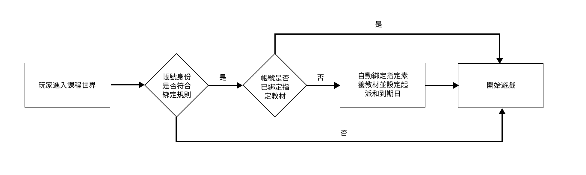

# 三、解決方案

## 功能(Key Features)&#x20;

1. 管理者介面->進階設定新增以下的權限控管
   1. 玩家進入遊戲後自動綁定指定素養教材。
   2. 選擇教材的起派日期和到期日。

## 用戶流程(User Flow)

<figure><figcaption></figcaption></figure>

## 執行方案

管理者介面->進階設定的課程加入限制區塊，新增以下的權限控管

1. 玩家加入課程自動綁定指定素養教材，如開啟需設定欄位如下
2. 請選擇需啟用自動綁定的帳號身份
   * 教師權限/全部(學生和教師都綁定)
3. 商品教材代碼
   * 備註1：商品類型(category)需要是『體驗』的才能進行自動綁定。
   * 備註2：要綁定的商品需設定為線上付款。
4.  選擇教材起派日和到期日

    * 如果有改動時間，需滿足此條件才會觸發：
      1. **開始的時間不能比本來晚**<mark style="color:$danger;">**且**</mark>**結束時間不能比本來早。**
    * 範例：A教材如圖所示，原本綁定時段&#x70BA;**`12/7~12/15`**
      1. 呈範例，後台將時段改&#x70BA;**`12/6~12/16`**，如圖<mark style="color:$danger;">**`紅色`**</mark>所示，則已綁定的人教材時間也<mark style="color:$danger;">`會跟著變動`</mark>為新時段
      2. 呈範例，後台將時段改&#x70BA;**`12/8~12/18`**，如圖<mark style="color:orange;">**`橘色`**</mark>所示，則已綁定的人教材時間<mark style="color:$danger;">`不會變動`</mark>，新綁定的人才會是12/8\~12/18，因爲開始的時間比本來晚。
      3. 呈範例，後台將時段改&#x70BA;**`12/9~12/13`**，如圖<mark style="color:blue;">**`藍色`**</mark>所示，則已綁定的人教材時間<mark style="color:$danger;">`不會變動`</mark>，新綁定的人才會是12/9\~12/13，因爲開始的時間比本來晚，結束的時間比本來早。
      4. 呈範例，後台將時段改&#x70BA;**`12/5~12/11`**，如圖<mark style="color:green;">**`綠色`**</mark>所示，則已綁定的人教材時間<mark style="color:$danger;">`不會變動`</mark>，新綁定的人才會是12/5\~12/11，因爲結束的時間比本來早。

    <figure><figcaption></figcaption></figure>

<figure><figcaption></figcaption></figure>

