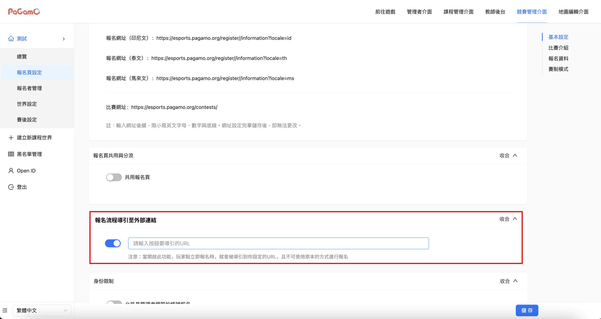

# 三. 解決方案

## 參考連結

FIGMA：[點我](https://www.figma.com/design/ImTk3nDbNGBgbqZorTI7Cs/%E9%9B%BB%E7%AB%B6%E5%BE%8C%E5%8F%B0%E5%84%AA%E5%8C%96?node-id=5-661\&p=f\&t=sEurcdeiR5sViaGf-0)

## 功能(Key Features)

1. 電競後台，新增報名外部導引的功能
   1. 管理者可從後台設定，將報名按鈕連結至指定的外部 URL。
   2. 不能使用原本方式來進行報名，避免發生重複報名的錯誤
2. 電競後台，新增讓管理者可新增獨立按鈕的功能
   1. 管理者可新增獨立按鈕，於賽後發布並導引參賽者前往相關資訊佈達頁面。

## 用戶流程(User Flow)

假如管理者在電競後台有設定外部報名方式和新增獨立按鈕，玩家於電競報名頁面能使用功能如下。

1. 當玩家點選立即報名按鈕時，會被導引到設定好的URL報名頁面
2. 當玩家點選獨立按鈕時，會被導引到設定好的URL頁面

## 實作方向-管理者後台

1. 電競管理後台->報名頁設定->新增報名流程導引至外部連結功能
   * 如開啟此功能，報名頁的立即報名會把玩家導引到設定的URL
   * 如開啟此功能，原本的報名會無法使用，不可在用本來方式進行報名

<figure><figcaption>
新增報名流程導引至外部連結功能
</figcaption></figure>

2. 電競管理後台->報名頁設定->新增設定其他按鈕功能。

* 報名頁設定，新增設定其他按鈕的功能，管理者可以設定內容如下
  * 按鈕名稱
  * 按鈕的導引連結

<figure><figcaption></figcaption></figure>

<figure><figcaption>
前台顯示的示意圖
</figcaption></figure>
