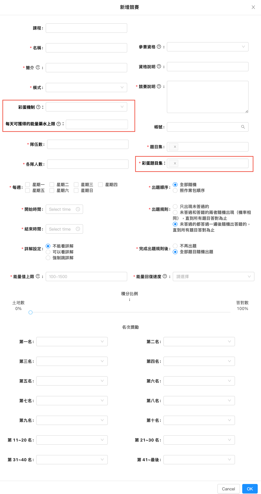

# 官方競賽之盾設定-實作方向


**此功能已確定先不實作，僅提供參考。**



設定頁面位置：管理者後台->遊戲設定->官方競賽設定

備註：非全部新功能，是由舊的功能延伸更多欄位來做設定。


## 參考連結：

FIGMA連結：預排會議後補

## 需求目標：

官方競賽之盾加入彩蛋題玩法。

## 實作方向：

1. 原本的官方競賽之盾設定，新增下列3個設定選項，主要用來新增彩蛋機制。

<table><thead><tr><th width="157">新增的設定</th><th width="116">元件類型</th><th>選項</th><th>是否必填</th><th>欄位說明</th></tr></thead><tbody><tr><td>彩蛋玩法</td><td>下拉選單</td><td>1.開放  2.不開放</td><td>必填</td><td>開啟後，賽事會加入彩蛋機制玩法。</td></tr><tr><td>設定彩蛋題目</td><td>下拉選單</td><td>來源帳號裡的所有作業</td><td>如果有開放彩蛋玩法則必填，如沒開放就反灰</td><td>請選擇彩蛋題要使用的題目，題目來源是從教師後台裡設定為競賽之盾的作業。</td></tr><tr><td>每天可獲得的能量藥水上限</td><td>文字輸入框</td><td>-</td><td>如果有開放彩蛋玩法則必填，如沒開放就反灰</td><td>請填入每天因彩蛋題而獲得的能量藥水上限</td></tr></tbody></table>

<figure><figcaption>
原本的官方競賽之盾新增設定
</figcaption></figure>

2. 設定完成後，就能成功建立有彩蛋機制的官方競賽之盾，後續就比照原本流程進行。
