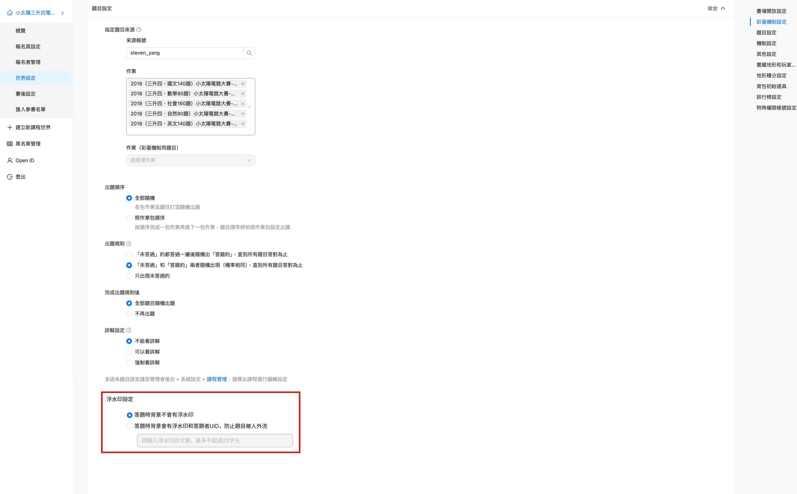

---
metaLinks:
  alternates:
    - https://app.gitbook.com/s/XCl2HWlBBmRgcY3xiRYF/san-jie-jue-fang-an
---

# 三、解決方案

## 功能(Key Features)&#x20;

1. 電競賽時讓每位玩家題目背景具身份識別的浮水印，用以嚇阻玩家翻拍或是截圖外流

## 用戶流程(User Flow)

管理者視角

* 管理者開電競賽時，可以自行設定是否開啟浮水印功能

玩家視角

* 如有開啟，玩家在答題時，題目和作答區塊的背景都會出現管理者設定的浮水印和自己UID

## 執行方案

電競後台，題目設定的區塊，新增『浮水印設定』，選項分別如下

1. 答題時背景不會有浮水印（此選項為預設值)
2. 答題時背景會有浮水印和答題者UID，防止題目被人外流
3. 呈上，如果選擇答題時有浮水印，則需要設定浮水印的文案，文案最多不超過20字

<figure><figcaption></figcaption></figure>

如該賽事有選擇開啟浮水印，則答題時在題目區塊和作答區塊都會個別有浮水印，規則如下

1. 2個區塊的浮水印不會橫跨
2. 區塊內的浮水印除了呈現後台設定文案外，還需帶入答題者的UID
3. 浮水印皆需壓到題目和答案
4. 浮水印功能需同步支援使用APP答題

<figure><figcaption></figcaption></figure>
