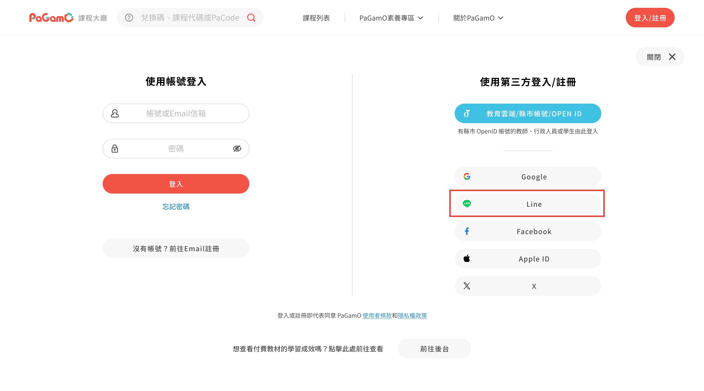

# 三. 解決方案

## 參考連結

FIGMA：[點我](https://www.figma.com/design/AT2MmZo8sIEViX51YZJbTB/43252-LINE%E7%99%BB%E5%85%A5%E4%B8%B2%E6%8E%A5?node-id=0-1\&p=f\&t=KNQ8px4VJtxSXdGY-0)

## 功能(Key Features)

1. 會員登入或註冊時，新增LINE的第三方選項
2. 會員中心綁定時，新增LINE選項。
3. 註冊流程中，如遇到已是PaGamO會員，提醒用戶使用帳號登入時，新增LINE選項

## 用戶流程(User Flow)

1. 玩家在會員登入頁時，選擇用LINE進行登入
2. 玩家授權PaGamO取得必要資訊
3. PaGamO確認玩家是否註冊過，是就會登入成功，否則會走註冊流程
4. 上述完整的FLOW可參考FIGMA：[點我](https://www.figma.com/design/AT2MmZo8sIEViX51YZJbTB/43252-LINE%E7%99%BB%E5%85%A5%E4%B8%B2%E6%8E%A5?node-id=0-1\&p=f\&t=KNQ8px4VJtxSXdGY-0)

## LINE相關金鑰

如需權限可以向葉子提出line developer的權限申請

正式站串接channel：[PaGamO Login](https://developers.line.biz/console/channel/2008115873)

測試站串接channel：[rdtest](https://developers.line.biz/console/channel/2008142215)

## 實作方向

1. 會員登入頁面新增LINE的第三方選項

<figure><figcaption></figcaption></figure>

2. 當會選擇LINE登入時，會比照現有第三方登入流程

<figure><figcaption></figcaption></figure>
