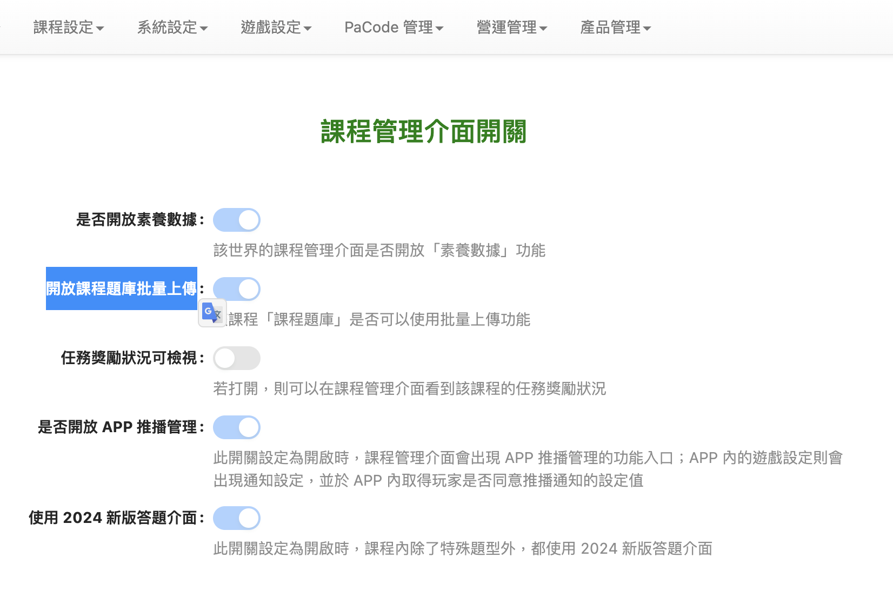

# 延伸優化

1. 管理後台－進階設定中，獨立出「課程題庫」的設定區塊，方便拓展產品付費服務，包含：
   1. 既有：
      1. 開放課程題庫批量上傳
   2. 潛在可能：
      1. 題組子題答對後，可不用再次填答
      2. 題目連結自選章節（知識點）
      3. 題組支援填充題與申論題
      4. 填充題答案可支援數學符號

<figure><figcaption>
既有進階設定介面（20250301)
</figcaption></figure>

2. 評估透過 UI 調整，降低遊戲答題介面中，文本文字量很多的視覺感受。

<figure><figcaption>
既有遊戲答題介面（20250301)
</figcaption></figure>

3. 課程題庫後台-進階設定中新增 disable 功能的機制，提示未開啟設定（付費）？
   1. 潛在：
      1. 題組子題答對不用重複答題
      2. 題組子題支援填充題與申論題
      3. 自定義知識點

