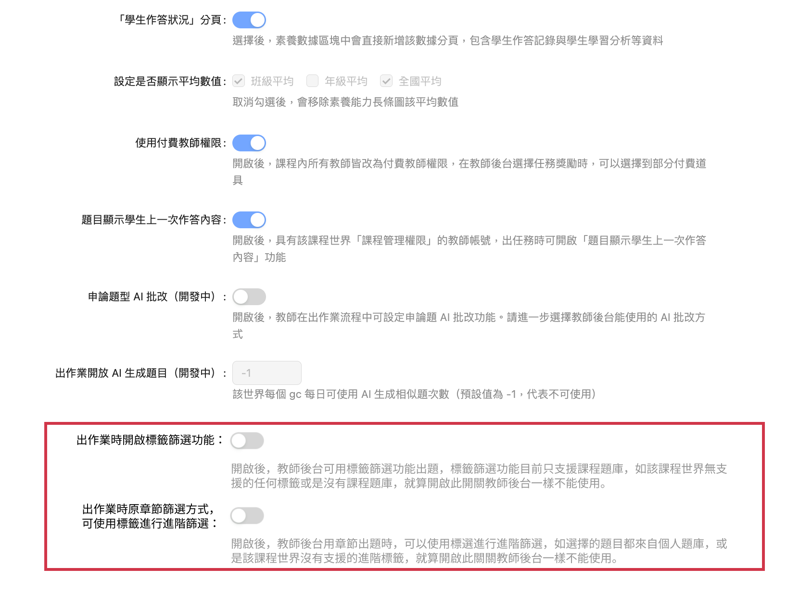

# 管理者後台-新增標籤篩選題目開關

## 參考連結

FIGMA：[點我](https://www.figma.com/design/YB9WjpbdDWB5mCT6bGx4qu/%E9%A1%8C%E7%9B%AE%E6%A8%99%E7%B1%A4%E5%8A%9F%E8%83%BD?node-id=2319-3613\&t=Cl2dLUNOGVDL4QEY-0)

## 需求目標

1. 管理者後台進階設定教師後台區塊，新增下述2種開關。
   1. 『 標籤篩選題目開關 』 的功能
   2. 『 章節出題(原出題方式)，開啟標籤篩開關 』 的功能

## 實作方向

1. 管理者後台->進階設定->教師後台區塊新增下述開關
   1. 標籤篩選題目開關
      1. 開啟後該課程世界的教師後台，可以使用標籤篩選功能出作業。
   2. 章節出題(原出題方式)，開啟標籤篩選開關
      1. 開啟後該課程世界的教師後台，如果使用章節找出題目後，還能用標籤做更進階的篩選查詢。

<figure><figcaption></figcaption></figure>

